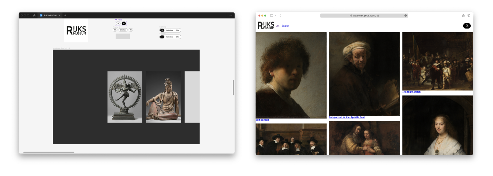

# Progressive Web Apps

## Course Info

### Goals

After finishing this program you can:

- *deal with server side rendering;*
- *implement a Service Worker;*
- *enhance the critical render path for a better runtime or percieved performance.*

### Rubic

| Deficiency | Criterion |
| --- | --- |
| Project | Your app is published and can be accessed using the browser. Your project is thoroughly documented in the README.mdfile in your repository. Included are an explanation of client- server rendering, an activity diagram including the Service Worker and a list of enhancements to optimize the critical render path implemented your app. |
| Serverside rendering | You’ve implemented serverside rendering and have articulated how it works and why you should want it. |
| Service Worker | You’ve implemented a usefull Service Worker and show it’s working in an activity diagram. |
| Critical render path | You’ve enhanced the critical render path for a better runtime or percieved performance in multiple ways and have described how you managed to do this. |

### User Story

> Als kunstliefhebber, wil ik thuis kunst uit het Rijksmuseum kunnen zoeken en bekijken, zodat ik tijdens een lockdown toch van kunst kan genieten.
> 



### RijksData API

Het Rijksmuseum verbindt mensen, kunst en geschiedenis. De databronnen van het RIjksmuseum vormen daarbij belangrijke bouwstenen.

Van schilderij tot scheepsmodel, je vindt het in de collectiedata van het Rijksmuseum. De gegevens van meer dan een half miljoen objecten hebben we inmiddels beschikbaar gemaakt voor hergebruik, de meeste met hoge resolutie objectfoto.


## Rendering

When it comes to rendering web content, there is Client-Side Rendering, Server-Side Rendering or a combination of both. Static Site Generation could also be an option but it isn't scalable. 

### Client Side Rendering

With Client Side rendering the html file is almost empty and Javascript dynamically renders and updates the content on the page without reloading the entire page.

```jsx
<!DOCTYPE html><html lang="en">  <head>    <meta charset="UTF-8" />    <link rel="icon" href="/favicon.ico" />    <meta name="viewport" content="width=device-width, initial-scale=1.0" />    <title>PWA</title>  </head>  <body>    <div id="app"></div>    <script type="module" src="/src/main.js"></script>  </body></html>
```

With This approach, search engines have a hard time understanding and indexing Client-Side Renderen content, which can potentially impact the SEO performance of a web page.

### Server Side Rendering

SSR is a technique that allows rendering web pages on the server and sending the fully rendered HTML to the client’s browser. The fully rendered HTML pages is the reason search engines can index the pages better, thats why its important for SEO.

To setup & configure a web server I have used nodeJS with the following packages:

- `expressjs`:Express is a minimal and flexible Node.js web application framework that provides a robust set of features for web and mobile applications.
- `nunjucks` Nunjucks is the SSR templapting engine I used.
- `express-nunjucks` handles some communication between the server and the templating engine.
- `nodemon` 
- `vite` for bundling, building, minification etc...

### MVC

The FileStructure I’ve used is based on the MVC Model.

```zsh
./src/server
├── controllers
│   ├── CollectionController.js
│   ├── HomeController.js
│   ├── SearchController.js
│   └── index.js
├── helpers
│   ├── api.js
│   └── templateHelpers.js
├── router
│   └── index.js
├── static
│   └── sw.js
└── views
    ├── base.njk
    ├── collection.njk
    ├── details.njk
    ├── error.njk
    ├── index.njk
    ├── partials
    │   ├── foot.njk
    │   ├── head.njk
    │   └── singleArticle.njk
    └── search.njk
```

### Routing

```jsx
import express from "express";
import { HomeController } from '../controllers/HomeController.js';
import { CollectionController, CollectionDetailsController } from '../controllers/CollectionController.js';
import { SearchController } from '../controllers/SearchController.js';

const router = express.Router();

router.get("/", HomeController);
router.get("/search/:q", SearchController);

router.get("/collection", CollectionController);
router.get("/collection/:id", CollectionDetailsController);

export default router;
```

### Controller

```jsx
import { searchAll, searchId } from "../helpers/api.js";
export const CollectionController = async (req,res, next) => {
	try {
		const data = await getCollection('Rembrand');
		return res.render('collection.njk', {
			title: 'Collecton',
			query: 'Rembrand',
			data: data
		})
	} catch (err) {
		console.log(err)
		next(err)
	}
}
export const CollectionDetailsController = async (req,res, next) => {
  const id = req.params.id;
	console.log(req.params)
	try {
		const data = await searchId(id);
		return res.render('details.njk', {
			title: 'Collecton',
			data: data
		})
	} catch (err) {
		console.log(err)
		next(err)
	}
}
export default CollectionController
```

## Service Worker
  
A Service worker handles the installation and caching logic of an PWA. By using a service worker the loading times can become faster, and specified files can be accesed even when the client is offline. 

## Critical render Path  


I chose to optimize the perceived load speed and load responsiveness as I identified these as areas where the application could improve significantly. I have minified the static files of the Javascript and the CSS are split up so the important css is rendered first. Also I’ve Implementing caching strategies that also led to better load performance on repeated visits to my application.


### Before Optimisation


.png)


.png)

### Improvements


To improve the initial page loading times, and reduce content jumping around I’ve applied the following:
#### CSS

```html
<link rel="stylesheet" rel="preload" href="/css/base.css"/>  
<link rel="stylesheet" href="/css/main.css"/>
```

#### Images

Add size so content doesnt jump around when images are loaded in. & `loading=“lazy”` for lazy loading images.

before:
```html

```

```html

```

I also found out that the Rijksmuseup API had `=s0` on the end of each img url when requested. I changed it to a different value because of curiousity. and this value changed the width of the image. *`=s0`* is the original image. I changed it to a smaller width wich also reduced loading times.

```js
const smallImageUrl = d.webImage && d.webImage.url.endsWith('=s0') ? d.webImage.url.replace('=s0', '=s400') : undefined;
```


#### Google Fonts
Ive removed some font variables, because they were unused. and added `&display=swap` to the url so its not blocking the font to show if its not fetched yet.

```html
<link rel="stylesheet" href="https://fonts.googleapis.com/css2family=Material+Symbols+Rounded:opsz,wght,FILL,GRAD@20..48,100..700,0..1,-50..200"/>
```

```html
<link rel="stylesheet" href="https://fonts.googleapis.com/css2?family=Material+Symbols+Rounded:opsz,wght,FILL,GRAD@24,500,1,0&display=swap"/>
```
